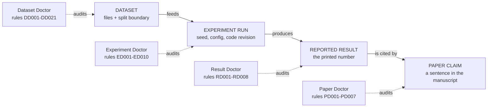
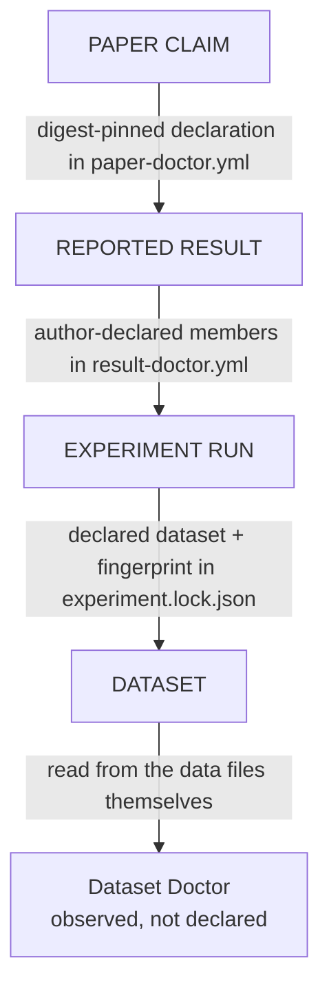
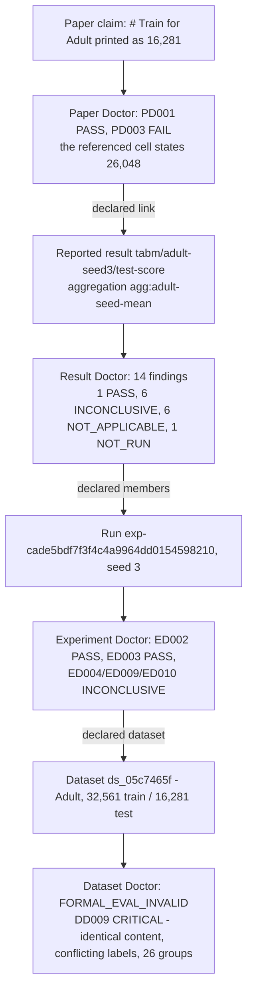

# ML Research Audit

[](https://github.com/xihaian251/ml-research-audit/actions/workflows/portal-checks.yml)


**End-to-end provenance auditing for machine-learning research.**

**面向机器学习科研的端到端证据链与可复现性审计工具栈。**

> Can you trace a paper claim all the way back to the data that produced it?
>
> 你能把论文中的一个结论，一路追溯到真正产生它的数据吗？

```text
DATASET  →  EXPERIMENT RUN  →  REPORTED RESULT  →  PAPER CLAIM
```

Four released command-line tools — the **Doctors** — audit those four layers one at a time,
instead of pretending a single tool can infer everything in between.

This repository is the public entrance to that stack. It is a **portal, not a fifth tool**: no
source code lives here, and nothing here changes the four tools underneath it.

**[English](#english) | [中文](#中文)**

---

<a name="english"></a>

## English

### Architecture

The **research lifecycle** runs left to right. Each Doctor **audits one layer** of it — the tool is
not a step in the pipeline.



An audit **reads backwards**, from the claim down to the data. Every cross-layer arrow below is a
link somebody wrote down — the stack never guesses one:



> [!NOTE]
> The dotted arrows are declarations, not data flow. **No tool calls another tool, and no tool
> discovers a link by similarity.** A declared field tells you who asserted it, which is exactly
> what an inferred link could never tell you. Declaration establishes provenance, not truth.

Certainty does not silently increase as you move up the chain: an `INCONCLUSIVE` or `UNKNOWN` at the
run layer stays that way at the paper layer. Details in
[docs/architecture.md](docs/architecture.md) and [docs/evidence-model.md](docs/evidence-model.md).

### The four Doctors

| Layer | Doctor | Core question | Source | Install |
| --- | --- | --- | --- | --- |
| Dataset | **Dataset Doctor** | Can this evaluation split be trusted? | [xihaian251/dataset-doctor](https://github.com/xihaian251/dataset-doctor) | [`dataset-doctor-audit`](https://pypi.org/project/dataset-doctor-audit/) |
| Experiment | **Experiment Doctor** | How did this run come to exist? | [xihaian251/experiment-doctor](https://github.com/xihaian251/experiment-doctor) | [`experiment-doctor`](https://pypi.org/project/experiment-doctor/) |
| Result | **Result Doctor** | How did these runs become this reported number? | [xihaian251/result-doctor](https://github.com/xihaian251/result-doctor) | [`result-doctor`](https://pypi.org/project/result-doctor/) |
| Paper | **Paper Doctor** | Does this claim match its declared evidence? | [xihaian251/paper-doctor](https://github.com/xihaian251/paper-doctor) | [`paper-doctor`](https://pypi.org/project/paper-doctor/) |

> [!IMPORTANT]
> **Dataset Doctor installs as `dataset-doctor-audit`.** `pip install dataset-doctor` fetches an
> unrelated project; the import package is `dataset_doctor_audit`.

Versions, CLI names, rule counts and known defects are in machine-readable form in
[`stack.yaml`](stack.yaml), and every value traces to a measurement in
[`research/COMPONENT_FACTS.md`](research/COMPONENT_FACTS.md). Use `pip show` — not a README table,
including this one — as the version authority for what is on your machine.

<details>
<summary>Release details: rules, CLI, version, Python</summary>

| Doctor | Rules | Command | Version | CI-verified platforms |
| --- | --- | --- | --- | --- |
| Dataset Doctor | `DD001`–`DD021` (21) | `dataset-doctor-audit` | [](https://pypi.org/project/dataset-doctor-audit/) | Linux + Windows · 3.11/3.12/3.13 |
| Experiment Doctor | `ED001`–`ED010` (10) | `experiment-doctor` | [](https://pypi.org/project/experiment-doctor/) | Linux only |
| Result Doctor | `RD001`–`RD008` (8) | `result-doctor` | [](https://pypi.org/project/result-doctor/) | Linux only |
| Paper Doctor | `PD001`–`PD007` (7) | `paper-doctor` | [](https://pypi.org/project/paper-doctor/) | Linux + Windows · 3.11/3.13 |

All four declare `requires_python >= 3.11` and are Apache-2.0 licensed (verified live against the
PyPI JSON API). They install into a single virtual environment without dependency conflicts, and
never import each other. Dataset Doctor is the only one that pulls a dataframe stack — numpy,
pandas, scipy, pyarrow; Result Doctor and Paper Doctor depend on PyYAML alone.

</details>

### Why this exists

A machine-learning paper usually shows you the final number. Between the data and that number sit
dataset versions, split boundaries, configs, seeds, runs, model selection, aggregation, unit
transformations, table cells and, finally, a sentence that cites them.

A provenance chain usually breaks somewhere in that list — and the break is invisible in the
finished table. Reconstructing it by hand is why reproducibility checks so often stop at "the code
is public" or "one person reran it and got roughly the same thing".

The stack's answer is to **refuse to bridge the gaps with inference**. Each layer is audited where
its own evidence lives, gaps are reported as gaps, and a link that nobody declared is left missing
rather than guessed. That is slower and less impressive than an automatic end-to-end check. It is
also the only version whose output a reader can argue with.

### 60-second install

The install and `--help` commands below are the ones recorded as executed against the published
wheels on Windows 10 / Python 3.13 on 2026-09-29; the full walkthrough with measured timings is
[docs/quickstart.md](docs/quickstart.md).

```bash
python -m venv .venv
# Linux / macOS
source .venv/bin/activate
# Windows PowerShell
.\.venv\Scripts\Activate.ps1

pip install dataset-doctor-audit experiment-doctor result-doctor paper-doctor
```

```bash
dataset-doctor-audit --help
experiment-doctor  --help
result-doctor      --help
paper-doctor       --help
```

**Use only the Doctor you need.** Installing all four is convenient, not required — most people
want exactly one of them, and the tools share no runtime.

Four things that will otherwise bite you in the first five minutes:

- `--version` exists on `result-doctor` and `paper-doctor` only; use `pip show` for the other two.
- `experiment-doctor --help` prints a stale "v0.1" string while the published distribution is 1.0.0.
- `--json` in Result Doctor and Paper Doctor **takes the output filename as its value**:
  `--json findings.json`. A shell redirect (`--json > findings.json`) is a usage error that leaves a
  0-byte file behind.
- `python -m paper_doctor` is not a supported entry point.

### Which Doctor should I use?

| I want to… | Start with | Shipped starting point |
| --- | --- | --- |
| check dataset leakage, split boundaries, duplicates, label shift | **Dataset Doctor** | `dataset-doctor-audit demo` |
| record how a run came to exist — seed, config, revision, environment | **Experiment Doctor** | `experiment-doctor init` + `audit` |
| reconstruct a reported number from the runs behind it | **Result Doctor** | [examples/minimal-result-manifest/](examples/minimal-result-manifest/README.md) |
| check that manuscript claims match the evidence they point to | **Paper Doctor** | `paper-doctor/examples/quickstart/` |

Realistic timing, measured rather than advertised: roughly **4–6 minutes** to a `FAIL` at the dataset
layer using the shipped `demo`, and **10–15 minutes** to reach one finding per layer. Those numbers
come from the shipped fixtures — a 10-minute audit of *your own* number is not promised, because
writing your own manifest costs more than running one. [docs/quickstart.md](docs/quickstart.md)
states that openly instead of hiding it.

Still unsure? [docs/component-guide.md](docs/component-guide.md) routes by situation, including the
cases where the honest answer is "none of these four".

### A real chain, traced end to end

The stack has one completed four-layer acceptance run, on a third-party published paper:
**TabM: Advancing Tabular Deep Learning with Parameter-Efficient Ensembling** (ICLR 2025,
arXiv:2410.24210), upstream code pinned at commit `28e47ae3`.

One chain, in the direction an audit reads it:



Two of those findings are worth reading carefully, because they show what the tools are for:

- The `PD003 FAIL` says one narrow relation — a claim of `16281` against a printed cell of `26048`,
  delta `9767` — conflicts with the declared evidence. It is **a question for an author**, not a
  statement that the paper is wrong. It was deliberately left as `FAIL`: quietly editing a declared
  link until a finding disappears is the exact failure mode this stack exists to prevent.
- `ED004`, `ED009` and `ED010` stay `INCONCLUSIVE`, and the seed universe behind the reported
  15-seed mean is declared `PARTIAL`. The reported mean `0.8575` never became an auditable claim at
  all, because the longtable cell that prints it has no reference name. Missing evidence stayed
  missing evidence.

> [!IMPORTANT]
> **This does not mean the TabM paper was reproduced.** No TabM training was executed; the
> Experiment Doctor capture recorded provenance around a configuration, not a completed run with a
> metric. The run establishes only that one real third-party chain can be traced across all four
> layers, and it does not establish that TabM's results are correct or incorrect.

Full record, including all eight `UNKNOWN`s and the reproduction steps:
[docs/end-to-end-tabm.md](docs/end-to-end-tabm.md). One caveat for anyone re-running it: if your own
Adult copy has a different fingerprint, your Dataset Doctor findings are about **your** copy, not
about the chain above.

### How to read the statuses

`Result Doctor`, `Paper Doctor` and `Experiment Doctor` share five rule-level statuses. They come
straight from the tools' own `--help` output:

| Status | What it means |
| --- | --- |
| `PASS` | this narrow relation is supported by the evidence on file — nothing more |
| `FAIL` | one rule found one narrow relation conflicting with the declared evidence |
| `INCONCLUSIVE` | not enough evidence on file to decide; this names the artifact to go record |
| `NOT_APPLICABLE` | the relation does not exist for this target |
| `NOT_RUN` | no target of the class this rule reads was supplied |

`UNKNOWN` is deliberately **not** a sixth rule status. It is a property of *evidence* (grades
`DIRECT / DERIVED / DECLARED / INFERRED / UNKNOWN`) and of Experiment Doctor's per-field provenance
scale (`CONFIRMED / SUPPORTED / INFERRED / UNKNOWN / CONFLICTING`). A rule whose evidence is
`UNKNOWN` normally prints `INCONCLUSIVE`, so the chain missing evidence → inconclusive rule → named
gap stays inspectable.

> [!WARNING]
> **Dataset Doctor does not use this table.** It audits data, not claims, and has its own
> evaluation-boundary vocabulary: `AuditStatus` adds `WARNING`, `UNSUPPORTED`, `SUPPRESSED`;
> `Severity` and `FormalImpact` rate each finding; and its aggregate is
> `FORMAL_EVAL_SAFE` / `FORMAL_EVAL_RISKY` / `FORMAL_EVAL_INVALID` / `INCONCLUSIVE`. That aggregate
> is a word, not a score — no arithmetic behind it, computed only over the rules that could run,
> and `SAFE` means "no blocking issue found by the rules that could run".
>
> It is also the **one tool whose exit code reacts to findings**: `audit` exits `1` on a blocking
> finding, while Result Doctor and Paper Doctor return `0` whatever the audit concludes. Scripting
> all four identically is a mistake.

Per-tool contracts, exit-code ladders and the two documented traps:
[docs/status-semantics.md](docs/status-semantics.md).

### What this project does not claim

These limits are the project's position, not its gaps. Read them first if you plan to cite the
tools or build on them.

| It does not | Because |
| --- | --- |
| Produce an aggregate score for a paper, a run, or a reported number | merging unlike evidence into one number makes it unreadable and unfalsifiable |
| Rule a paper true, false, reliable, or unreliable | auditing provenance is not adjudicating scientific truth |
| Label a finding misconduct or fraud | a `FAIL` is one rule disagreeing with one piece of declared evidence |
| Use a language model as a judge | a probabilistic reader cannot be the authority on whether a number matches a number |
| Upgrade certainty as evidence moves up the chain | an `INCONCLUSIVE` at the run layer does not become a `PASS` at the paper layer |
| Discover cross-layer links on its own | every link is declared, so it can be traced back to who asserted it |
| Certify reproducibility | it records what is known about provenance; `UNKNOWN` stays `UNKNOWN` instead of being guessed away |

> [!NOTE]
> `UNKNOWN` is a valid result. The stack prefers missing evidence over invented certainty.

### Where the project actually stands

Measured, not claimed. Read [STACK_STATUS.md](STACK_STATUS.md) before quoting any of this.

| Axis | State |
| --- | --- |
| Scientific design of the four layers | complete |
| Public component releases | complete — 4 of 4 on PyPI |
| End-to-end acceptance on a third-party project | complete once, on TabM |
| Community adoption | early |
| Independent external users | **0 observed** |
| Real human first-use test of Paper Doctor | **NOT OBSERVED** — waived by the owner for 0.1.0, never recorded as passed |

One timing figure on record, measured rather than advertised: a fresh *agent* working only from the
public documentation reached its first Paper Doctor finding in about 11 minutes across ~41 commands
([research/FRESH_USER_AUDIT.md](research/FRESH_USER_AUDIT.md)). **That is an agent, not a person.**
The proxy runs are a defect-finding instrument, and they produced documentation fixes — not evidence
about human onboarding, which remains the project's main open gap.

The distance between "released" and "used by people who did not build it" is the honest state of
this project.

### Documentation

| Read | For |
| --- | --- |
| [docs/quickstart.md](docs/quickstart.md) | install, verify, and run one audit per layer from shipped fixtures |
| [docs/architecture.md](docs/architecture.md) | why four tools and not one, and where each responsibility ends |
| [docs/component-guide.md](docs/component-guide.md) | which Doctor your situation actually needs |
| [docs/evidence-model.md](docs/evidence-model.md) | observed vs declared vs derived vs unknown evidence |
| [docs/status-semantics.md](docs/status-semantics.md) | what each status means per tool, and exit codes |
| [docs/end-to-end-tabm.md](docs/end-to-end-tabm.md) | the full four-layer trace, with every gap preserved |
| [docs/faq.md](docs/faq.md) | the questions a careful reader asks first |
| [docs/community.md](docs/community.md) | contributions that add value without touching core rules |
| [STACK_STATUS.md](STACK_STATUS.md) | measured status, waivers, and known defects |
| [ROADMAP.md](ROADMAP.md) | what happens next, and what will not happen without evidence |
| [CONTRIBUTING.md](CONTRIBUTING.md) · [SECURITY.md](SECURITY.md) · [CODE_OF_CONDUCT.md](CODE_OF_CONDUCT.md) | how to take part |

### Contributing

**We are especially looking for real-world case studies, external projects, bug reports, and
first-time users.** What this project needs least right now is more internal functionality; what it
needs most is evidence of these tools being used by people who did not build them — including,
especially, failure reports.

Good first contributions:

- Try the quickstart on **your own** experiment and open an onboarding report telling us where you
  got stuck. The onboarding issue form is the one the project needs most.
- Add a case study: any public paper or project where one number can be traced, or where the trace
  provably cannot be completed.
- Report a stale command, a confusing flag, or a doc that did not survive contact with a real user.

This repository has structured issue forms for the four things it can legitimately be wrong about: a
portal defect, a documentation defect, an external onboarding report or case study, and a feature
proposal that has answered which real user needs it.

**Where problems belong.** Report a bug in the **component's own repository**, not here:

| Symptom | Repository |
| --- | --- |
| leakage, split, fingerprint, dataset-audit behaviour | [dataset-doctor](https://github.com/xihaian251/dataset-doctor/issues) |
| capture, run identity, seed, environment, adapter behaviour | [experiment-doctor](https://github.com/xihaian251/experiment-doctor/issues) |
| aggregation, membership, selection, reported-result provenance | [result-doctor](https://github.com/xihaian251/result-doctor/issues) |
| claim, anchor, evidence-link, LaTeX parsing behaviour | [paper-doctor](https://github.com/xihaian251/paper-doctor/issues) |
| documentation, onboarding, ecosystem metadata, a new case study | **this repository** |

Start with [CONTRIBUTING.md](CONTRIBUTING.md) and [docs/community.md](docs/community.md). Stars are
welcome, but usage is the thing that moves this project forward.

### License

Apache-2.0 for the documentation and scripts in this repository. The four components are Apache-2.0
in their own repositories; this repository vendors none of their source.

---

<a name="中文"></a>

## 中文

四个已发布的命令行工具，分别审计科研链条的四层：

```text
数据集  →  实验运行  →  论文报告结果  →  论文主张
```

本仓库是这套工具栈的公开入口，是**门户，不是第五个工具**：这里没有源码，也不会改动下层四个工具。
英文完整文档见上方 [English](#english)。

### 为什么要拆成四个工具

一篇论文通常只给你最终那个数字。而在数据和数字之间，隔着数据版本、切分边界、配置、随机种子、
多次运行、选择过程、聚合方式、单位变换、表格单元格，最后才是一句引用它们的论文主张。

科研证据链往往就在中间某一环断掉，而且在成品表格里完全看不出来。这套工具栈的立场是：**不用推测
去填补证据链缺口**。每一层只在自己的证据所在处接受审计，缺口就报告为缺口；没有人声明过的链接，
就让它保持缺失，而不是靠相似度猜出来。声明只建立溯源，不建立真伪。

分层的完整理由与各层职责边界见 [docs/architecture.md](docs/architecture.md)，观察/声明/派生/未知
四类证据的区分见 [docs/evidence-model.md](docs/evidence-model.md)，按场景选型见
[docs/component-guide.md](docs/component-guide.md)。

### 四个 Doctor

| 层 | 工具 | 回答的核心问题 | 仓库 | PyPI |
| --- | --- | --- | --- | --- |
| 数据集 | **Dataset Doctor** | 这个评测切分可信任吗？ | [dataset-doctor](https://github.com/xihaian251/dataset-doctor) | [dataset-doctor-audit](https://pypi.org/project/dataset-doctor-audit/) |
| 实验 | **Experiment Doctor** | 这次运行是怎么产生的？ | [experiment-doctor](https://github.com/xihaian251/experiment-doctor) | [experiment-doctor](https://pypi.org/project/experiment-doctor/) |
| 结果 | **Result Doctor** | 这些运行是怎么变成这个报告数字的？ | [result-doctor](https://github.com/xihaian251/result-doctor) | [result-doctor](https://pypi.org/project/result-doctor/) |
| 论文 | **Paper Doctor** | 这条论文主张与它声明的证据一致吗？ | [paper-doctor](https://github.com/xihaian251/paper-doctor) | [paper-doctor](https://pypi.org/project/paper-doctor/) |

### 快速开始

```bash
python -m venv .venv
pip install dataset-doctor-audit experiment-doctor result-doctor paper-doctor
```

```bash
dataset-doctor-audit --help
experiment-doctor  --help
result-doctor      --help
paper-doctor       --help
```

上面的安装与 `--help` 命令，是 2026-09-29 在 Windows 10 / Python 3.13 下用已发布的 wheel 实测执行过
的那一组；完整流程与耗时见 [docs/quickstart.md](docs/quickstart.md)。

**Dataset Doctor 的安装名是 `dataset-doctor-audit`**，`pip install dataset-doctor` 装到的是同名但无关
的项目。

**只装你需要的那一个就够了。** 四个工具互不导入，多数场景只需要其中一个。

- 查数据泄漏、切分边界、重复样本、标签漂移 → Dataset Doctor（先跑 `dataset-doctor-audit demo`）
- 记录运行的种子、配置、代码版本、环境 → Experiment Doctor（`init` 再 `audit`）
- 复现一个报告数字背后的成员与聚合 → Result Doctor（用
  [examples/minimal-result-manifest/](examples/minimal-result-manifest/README.md)）
- 检查稿件主张与声明证据是否对应 → Paper Doctor（用仓库内 `examples/quickstart/`）

`result-doctor` 和 `paper-doctor` 有 `--version`，另外两个没有，统一用 `pip show` 确认版本。
`--json` 需要**接文件名**（`--json findings.json`），用 shell 重定向会报错并留下一个 0 字节文件。

### 状态语义

Result / Experiment / Paper Doctor 共用五种规则状态，取自工具自己的 `--help`：

| 状态 | 含义 |
| --- | --- |
| `PASS` | 现有证据支持这一条**窄关系**，仅此而已 |
| `FAIL` | 某一条规则发现一处窄关系与声明的证据冲突 |
| `INCONCLUSIVE` | 证据不足，无法判断——它同时告诉你该去补记录哪个产物 |
| `NOT_APPLICABLE` | 这个对象上不存在待检查的关系 |
| `NOT_RUN` | 没有为该规则提供任何可检查的对象 |

`UNKNOWN` 刻意**不是**第六种规则状态，它是**证据本身的属性**（证据分级
`DIRECT / DERIVED / DECLARED / INFERRED / UNKNOWN`，以及 Experiment Doctor 的字段级溯源分级
`CONFIRMED / SUPPORTED / INFERRED / UNKNOWN / CONFLICTING`）。

> [!WARNING]
> Dataset Doctor 不套用上面这张表。它审计的是数据而不是主张，有自己独立的评测边界语义：
> `FORMAL_EVAL_SAFE` / `RISKY` / `INVALID` / `INCONCLUSIVE`，外加 `WARNING`、`Severity`、
> `FormalImpact` 等轴。这个汇总结论是一个**词而不是分数**：没有算术，只统计真正执行过的规则，
> `SAFE` 的原话含义是"可执行的规则未发现阻断性问题"。它也是四个工具里**唯一让退出码随发现变化**的
> 一个：`audit` 遇到阻断性发现会退出 `1`，而 Result Doctor 与 Paper Doctor 无论结论如何都返回 `0`。

完整的跨工具契约见 [docs/status-semantics.md](docs/status-semantics.md)。

### 一个真实案例：TabM 的四层溯源

目前唯一完成的一次四层端到端验收，对象是第三方已发表论文 TabM（ICLR 2025, arXiv:2410.24210），
上游代码固定在 commit `28e47ae3`。审计按反向读取：

```text
论文主张（# Train for Adult 印作 16,281）
  → Paper Doctor：PD001 PASS，PD003 FAIL（被引用的单元格印作 26,048）
  → 报告结果 tabm/adult-seed3/test-score，聚合 agg:adult-seed-mean
  → Result Doctor：14 条发现 = 1 PASS / 6 INCONCLUSIVE / 6 NOT_APPLICABLE / 1 NOT_RUN
  → 运行 exp-cade5bdf7f3f4c4a9964dd0154598210（seed 3）
  → Experiment Doctor：ED002、ED003 PASS；ED004、ED009、ED010 INCONCLUSIVE
  → 数据集 ds_05c7465f（Adult，32,561 训练 / 16,281 测试）
  → Dataset Doctor：FORMAL_EVAL_INVALID，DD009 CRITICAL（同内容跨切分标签冲突，26 组）
```

> [!IMPORTANT]
> **这不代表整个 TabM 论文被复现了。** 没有执行任何 TabM 训练；Experiment Doctor 记录的是围绕一个
> 配置的溯源信息，不是一次带指标的完整运行。这次验收只证明：一条真实的第三方证据链可以横跨四层被
> 追溯。它既不能说明论文结果是正确的，也不能说明是错误的。

`PD003 FAIL` 是**一个该问作者的问题**，不是"论文写错了"。它被刻意保留而没有改成通过——把声明链接
悄悄改到发现消失，正是这套工具栈要防止的行为。报告均值 `0.8575` 甚至没能成为可审计的主张，因为
打印它的 longtable 单元格没有 reference name，于是它继续保持 `UNKNOWN`。

完整记录（含八处 `UNKNOWN` 与复现步骤）见 [docs/end-to-end-tabm.md](docs/end-to-end-tabm.md)。

### 这个项目不声称什么

- 不给论文、运行或报告数字产出任何**汇总分数**
- 不判定论文为真、为假、可靠或不可靠
- 不给任何发现贴学术不端或造假标签
- 不用大模型当裁判
- 不允许确定度沿证据链**向上传导放大**
- 不自动推断跨层链接
- 不声称这套工具栈能证明可复现性

> [!NOTE]
> `UNKNOWN` 是一种合法结果。这套工具栈宁缺证据，也不制造确定性。

### 现状（实测口径）

四层科学设计已完成；四个组件已全部发布于 PyPI；第三方端到端验收**完成过一次**（TabM）；
社区采用仍在早期；**独立外部用户 0 例（观测到的）**；Paper Doctor 的真人首次使用测试
**NOT OBSERVED**——由负责人在 0.1.0 上豁免，但从未记录为通过。

关于"从零上手要多久"，目前只有一项记录，而且记录的是 agent：一个全新 *agent* 只依据公开文档，约
11 分钟、约 41 条命令走到第一个 Paper Doctor 发现
（[research/FRESH_USER_AUDIT.md](research/FRESH_USER_AUDIT.md)）。**那是 agent，
不是人**，它产出的是文档修补，不构成人类上手证据。引用任何状态前先读
[STACK_STATUS.md](STACK_STATUS.md)。

### 参与方式

**目前最希望获得的不是更多内部功能，而是真实项目中的试用、失败案例、Issue、PR 和新的 case
study。** 最需要的贡献，是拿自己的实验跑一遍快速开始，然后告诉我们卡在哪一步——onboarding
表单是本项目最需要的一类 issue。

Bug 请报到**对应组件自己的仓库**，不要报在这里：数据泄漏与切分行为归
[dataset-doctor](https://github.com/xihaian251/dataset-doctor/issues)，运行捕获与适配器归
[experiment-doctor](https://github.com/xihaian251/experiment-doctor/issues)，聚合与成员归
[result-doctor](https://github.com/xihaian251/result-doctor/issues)，主张与 LaTeX 解析归
[paper-doctor](https://github.com/xihaian251/paper-doctor/issues)；文档、上手流程、生态元数据和新
案例研究归**本仓库**。完整路由表见上方 [Contributing](#contributing)。

许可：本仓库文档与脚本为 Apache-2.0；四个组件在各自仓库同样是 Apache-2.0，本仓库不含它们的任何
源码。

[回到 English](#english)
