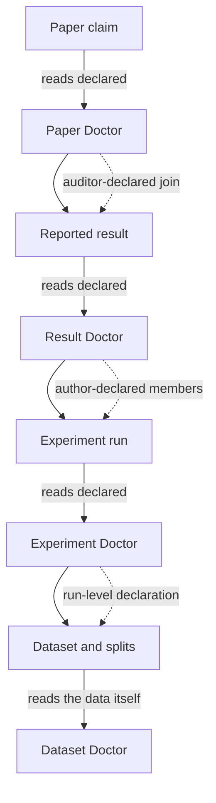

# ML Research Audit

**End-to-end provenance auditing for machine-learning research.**

> Can you trace a paper claim all the way back to the data that produced it?

ML Research Audit is the public entrance to four independent, released command-line tools that
answer that question one layer at a time. It is a portal, not a fifth tool: no source code lives
here, and nothing here changes the four tools underneath it.

```
DATASET → EXPERIMENT RUN → REPORTED RESULT → PAPER CLAIM
```

## The architecture



Every arrow is a **declared** relation. The stack does not discover links between layers by
similarity, by name, or by model inference: a Paper Doctor audit only reads the evidence links an
auditor wrote down, and Result Doctor only reads the members a manifest enumerates. That is a
deliberate design choice, not a missing feature — see
[docs/architecture.md](docs/architecture.md) and [docs/evidence-model.md](docs/evidence-model.md).

## The four Doctors

| Layer | Question it answers | Tool | PyPI | CLI | Release | Status |
| --- | --- | --- | --- | --- | --- | --- |
| Paper | Does this claim faithfully represent the evidence it explicitly points to? | [Paper Doctor](https://github.com/xihaian251/paper-doctor) | [`paper-doctor`](https://pypi.org/project/paper-doctor/) | `paper-doctor` | 0.1.0 (`v0.1.0`) | released |
| Result | How did these runs become this reported number? | [Result Doctor](https://github.com/xihaian251/result-doctor) | [`result-doctor`](https://pypi.org/project/result-doctor/) | `result-doctor` | 0.1.0 (`v0.1.0`) | released |
| Experiment | How did this run come to exist — seed, config, code revision, environment? | [Experiment Doctor](https://github.com/xihaian251/experiment-doctor) | [`experiment-doctor`](https://pypi.org/project/experiment-doctor/) | `experiment-doctor` | 1.0.0 (`v1.0.0`) | released |
| Dataset | What data entered the evaluation, and does the evaluation boundary hold? | [Dataset Doctor](https://github.com/xihaian251/dataset-doctor) | [`dataset-doctor-audit`](https://pypi.org/project/dataset-doctor-audit/) | `dataset-doctor-audit` | 0.1.2 (`v0.1.2`) | released |

All four require Python 3.11 or newer and are Apache-2.0 licensed. Machine-readable versions live in
[`stack.yaml`](stack.yaml), and every value is traceable to a measurement in
[`research/COMPONENT_FACTS.md`](research/COMPONENT_FACTS.md).

⚠️ **Dataset Doctor installs as `dataset-doctor-audit`.** `pip install dataset-doctor` fetches an
unrelated project. The import package is `dataset_doctor_audit`.

## Start here

```bash
pip install dataset-doctor-audit experiment-doctor result-doctor paper-doctor

dataset-doctor-audit --help
experiment-doctor  --help
result-doctor      --help
paper-doctor       --help
```

Ten-minute onboarding: [docs/quickstart.md](docs/quickstart.md). Which tool you actually need:
[docs/component-guide.md](docs/component-guide.md). A full four-layer trace of one real number in a
real published paper: [docs/end-to-end-tabm.md](docs/end-to-end-tabm.md).

## What this stack deliberately does not do

These limits are the project's position, not its gaps. They are the first thing to read if you plan
to cite the tools or build on them.

| It does not | Because |
| --- | --- |
| Produce a global score for a paper, a run, or a dataset | an aggregate number would silently merge unlike evidence |
| Rule a paper true, false, reliable, or unreliable | auditing provenance is not adjudicating scientific truth |
| Label a finding misconduct or fraud | a `FAIL` is one rule disagreeing with one piece of declared evidence — a question to ask an author, not a verdict |
| Use a language model as a judge | a probabilistic reader cannot be the authority on whether a number matches a number |
| Upgrade certainty as evidence moves up the chain | an `INCONCLUSIVE` at the run layer does not become a `PASS` at the paper layer |
| Discover cross-layer links on its own | every link is declared, so a link can be traced back to who asserted it |
| Prove reproducibility | it records what is known about provenance; UNKNOWN stays UNKNOWN instead of being guessed away |

`UNKNOWN` and `INCONCLUSIVE` are first-class results here. A tool that says "the evidence on file
does not decide this" is working correctly. See
[docs/status-semantics.md](docs/status-semantics.md).

## Status

| Axis | State |
| --- | --- |
| Scientific design of the four layers | complete |
| Public component releases | complete (4 of 4 on PyPI) |
| End-to-end acceptance on a third-party project | complete once, on TabM (see the case study) |
| Community adoption | early — measured, not claimed |
| Independent external users | **0 observed** |
| Real human first-use test of Paper Doctor | **NOT OBSERVED** — waived by the owner for 0.1.0, and never recorded as passed |

Read [STACK_STATUS.md](STACK_STATUS.md) before quoting any of this. The gap between "released" and
"used by people who did not build it" is the honest state of this project.

## Where problems belong

Report a bug in the **component's own repository**, not here:

| Symptom | Repository |
| --- | --- |
| leakage, split, fingerprint, dataset-audit behaviour | [dataset-doctor](https://github.com/xihaian251/dataset-doctor/issues) |
| capture, run identity, seed, environment, adapter behaviour | [experiment-doctor](https://github.com/xihaian251/experiment-doctor/issues) |
| aggregation, membership, selection, reported-result provenance | [result-doctor](https://github.com/xihaian251/result-doctor/issues) |
| claim, anchor, evidence-link, LaTeX parsing behaviour | [paper-doctor](https://github.com/xihaian251/paper-doctor/issues) |
| documentation, onboarding, ecosystem metadata, a new case study | **this repository** |

This repository has structured issue forms for the four things it can legitimately be wrong about:
a portal defect, a documentation defect, an external onboarding report or case study, and a feature
proposal that has answered which real user needs it. The onboarding form is the one the project needs
most — see [docs/community.md](docs/community.md).

## Documents

| Read | For |
| --- | --- |
| [docs/quickstart.md](docs/quickstart.md) | install, verify, and run one audit per layer in ~10 minutes |
| [docs/architecture.md](docs/architecture.md) | why four tools and not one, and where each responsibility ends |
| [docs/component-guide.md](docs/component-guide.md) | which Doctor your situation actually needs |
| [docs/evidence-model.md](docs/evidence-model.md) | observed vs declared vs derived vs unknown evidence |
| [docs/status-semantics.md](docs/status-semantics.md) | what PASS / FAIL / INCONCLUSIVE / UNKNOWN mean per tool |
| [docs/end-to-end-tabm.md](docs/end-to-end-tabm.md) | one published number traced through all four layers |
| [docs/faq.md](docs/faq.md) | the questions a careful reader asks first |
| [docs/community.md](docs/community.md) | contributions that add value without touching core rules |
| [ROADMAP.md](ROADMAP.md) | what happens next, and what will not happen without evidence |
| [CONTRIBUTING.md](CONTRIBUTING.md) · [SECURITY.md](SECURITY.md) · [CODE_OF_CONDUCT.md](CODE_OF_CONDUCT.md) | how to take part |

## License

Apache-2.0 for the documentation and scripts in this repository. The four components are Apache-2.0
in their own repositories; this repository vendors none of their source.
