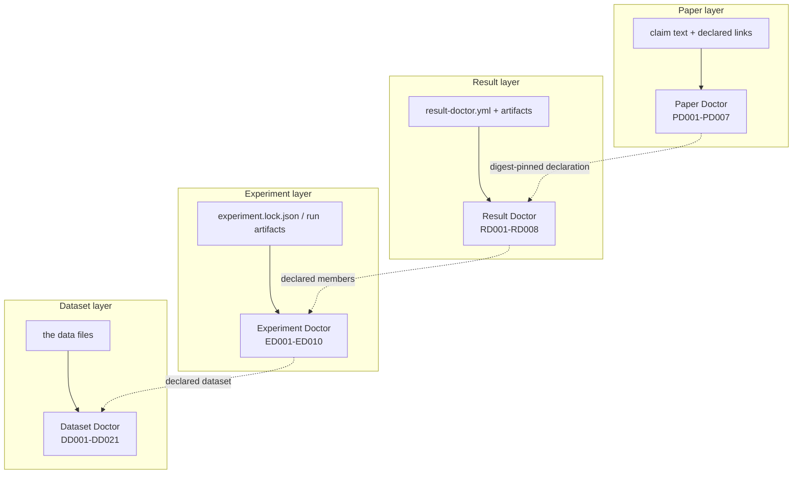

# Architecture

Why this is four programs and one portal, and where each responsibility begins and ends.

## 1. The object each layer owns

An ML result is produced by a sequence of decisions, and each decision has a different kind of
evidence. The stack follows that structure instead of inventing a unified model:

| Layer | Object owned | The question | Who authors the evidence |
| --- | --- | --- | --- |
| Dataset | a dataset and its split boundary | what data entered the evaluation, and does the boundary hold? | the tool observes the files themselves |
| Experiment | one run | how did this run come to exist? | the capture pipeline at run time, or an auditor afterwards |
| Result | a reported number | how did these runs become this printed cell? | the author of the manifest |
| Paper | a sentence in a manuscript | does the claim match the evidence it points to? | the auditor who writes the links |

Read bottom to top, evidence gets less direct. At the dataset layer the tool hashes bytes it read
from disk. At the paper layer the tool compares a sentence against a declaration someone typed. That
asymmetry is the reason for the last principle in this list, and the reason the tools refuse to
convert `INCONCLUSIVE` below into `PASS` above.



The dotted arrows are declarations, not data flow. No tool calls another tool. No tool discovers a
link by similarity.

## 2. Why not one program

Four reasons, all of them load-bearing.

**Different inputs, different failure modes.** Dataset Doctor walks Parquet files and image
directories; Paper Doctor parses LaTeX. Merging them means one parser's crash can take down an
unrelated audit, and one dependency graph for four jobs that never need each other's libraries.
Dataset Doctor pulls numpy, pandas, scipy, pyarrow, pillow; Result Doctor and Paper Doctor need
PyYAML alone. A user auditing a manuscript should not install a dataframe stack.

**Different release cadences.** A leakage rule and a LaTeX cell-addressing rule have nothing to
test each other. Four version lines let each tool freeze when its own science is settled —
Experiment Doctor is at 1.0.0 while Paper Doctor is at 0.1.0, and that difference is meaningful
rather than embarrassing.

**Different evidence contracts.** Each tool has its own status vocabulary and its own exit-code
contract. A single binary would have to flatten them into one score, and a flattened score is the
one output this project has decided not to produce.

**Auditable authority.** When a trace says "this run belongs to that aggregation", the answer to
"who said so?" must name a manifest and a field. One tool that inferred the join internally would
bury that answer inside a binary.

## 3. Responsibility boundaries — what each tool explicitly refuses

These are not missing features. They are the boundaries that keep the layers from laundering
certainty into each other.

**Dataset Doctor is not a data-cleaning tool.** It reports leakage, duplicates, entity and target
leakage, drift, and it fingerprints data to make a version traceable. It will not repair a split,
drop a duplicate, or tell you your dataset is good. Its verdict describes whether a *formal
evaluation* on those splits can be trusted, not whether the data is "clean" — a word with no
definition here.

**Experiment Doctor is not a training framework.** It does not schedule runs, tune hyperparameters,
store checkpoints, or replace an experiment tracker. `init` and `run` record evidence around a
command you already own; the training command is opaque to it. It also does not compute metrics: the
captured adapter deliberately emits no metric, because inventing one would be guessing.

**Result Doctor does not judge claims.** It answers how runs became a reported number: aggregation
membership, selection, candidate sets, transformations, comparison sets. It never reads a sentence,
never compares a claim to evidence, and has no opinion about a paper. A clean Result Doctor run
certifies nothing about correctness of the science — only that the evidence you supplied was enough
for these eight rules, and consistent.

**Paper Doctor does not re-audit result generation.** If a Result Doctor findings file is declared as
evidence, Paper Doctor reads the digest and the findings as authored. It does not re-run RD001–RD008,
does not recompose the bundle, and does not upgrade an upstream `INCONCLUSIVE` into anything
stronger. It also never infers a link: the only link bases are `AUTHOR_REF_IN_SENTENCE`,
`AUTHOR_NAMED_FLOAT`, and `AUDITOR_DECLARED`. It does not decide whether a citation is real, whether
a number is right in the world, or whether a paper is trustworthy.

## 4. How evidence crosses a layer

Concretely, in the one place a formal interface exists: Paper Doctor's manifest may pin a Result
Doctor findings file.

```yaml
_registry:
  rd_findings:
    path: findings.json
    sha256: c56b62623b39ed9a4c311f8bcc6be6de457c1a0f8a4d34d3da99a4b71c7d2774
    size: 12392
    rd_version: 0.1.0
```

The digest and size are verified as the manifest parses. Two properties follow: the evidence is the
author's own quoted artifact, and it cannot silently change under the audit. This is provenance, not
verification of the underlying claim — Paper Doctor still has to take Result Doctor's findings as
what they say they are.

Everything else crosses by human declaration:

| Join | Where it is written | What it is |
| --- | --- | --- |
| aggregation → its runs | `result-doctor.yml` member list | author-declared enumeration |
| reported cell → paper claim | `paper-doctor.yml` links | auditor- or author-declared basis |
| run → its dataset | `experiment.lock.json` or the manifest | a path and a fingerprint hash |
| dataset → its identity | Dataset Doctor report | computed from the bytes |

Only the last row is computed from observed data. The other three are statements a person wrote.
`docs/evidence-model.md` sorts them into observed, declared, derived, and unknown.

## 5. Trust boundaries

Each boundary is a place where a tool stops trusting and starts reporting what it was told.

| Boundary | What crosses | What the tool does NOT assume |
| --- | --- | --- |
| filesystem → Dataset Doctor | data files | that the files are the ones used in training |
| run artifacts → Experiment Doctor | lock and run JSON | that a recorded seed is the seed that produced the metric |
| bundle → Result Doctor | declared members and steps | that the enumeration is complete unless the universe is declared and evidenced |
| findings digest → Paper Doctor | a pinned file | that Result Doctor was right — only that this is the file it read |
| LaTeX source → Paper Doctor | the compiled source text | that the source corresponds to the published PDF |
| manifest → any tool | everything else | nothing; unquoted paths are never read |

The last line is the strongest guarantee in the design: no tool opens a file that a manifest did not
quote. That is what makes an audit reproducible by someone else, and it is why the tools can say
"the evidence on file" and mean it literally.

## 6. Invariants the implementation is tested against

- **No aggregate score.** No tool emits a number that merges unlike findings.
- **Certainty never increases upward.** An `INCONCLUSIVE` or `UNKNOWN` below stays that way above;
  no rule reads a downstream status as upstream support.
- **Findings do not control exit codes.** For Result Doctor and Paper Doctor, `0` means the audit
  ran, whatever it found; `2` means the manifest is not a readable contract; `1` means the tool
  itself failed. A scientific `FAIL` is a result, so it must never look like a crash.
- **Declaration establishes provenance, not truth.** Every declared field carries who declared it.
- **No LLM in the loop.** Every rule is deterministic code over parsed structures.
- **UNKNOWN is a state, not an error.** Output formats have a place for it and prose must not round
  it away.

## 7. What is deliberately absent

| Absent | Why |
| --- | --- |
| A monorepo | the four version lines and dependency graphs must stay independent |
| Git submodules or vendored source | the portal must not fork the components' identity |
| An umbrella PyPI package | a meta-package creates version governance nobody has asked for yet |
| Automatic cross-layer link discovery | an inferred link puts the tool's guess inside the audit trail |
| A fifth Doctor | the chain is four layers; adding a fifth is a scientific claim nobody has earned |
| A pipeline orchestrator | would silently imply that the joins are computed rather than declared |
